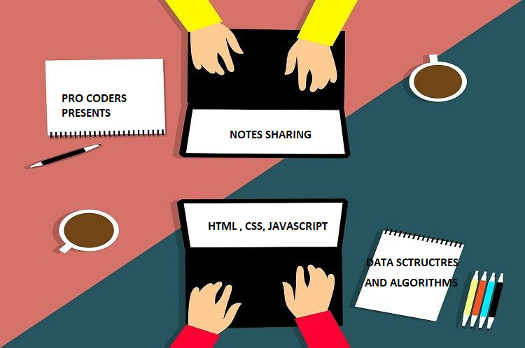

# Notes Share Web Application 
## *NIT MIZORAM unstop Hackathon* 

#### **Hello Evevryone** ! We The Team of *NIT Arunachal Pradesh* (**Pro Coders**) have designed the web application for the learning purpose of students and makes their online leaning more **efficient** and **interactive** over the internet.

> A notes sharing website to make student's learning journey more interactiva and smoother way

### Approch for the Project :

We had  first discussed the idea model and design and then started making the application and basically we had divided out work in parts and had stated making the application

### TEAM DETAILS

TEAM NAME : PRO CODERS 
(Registration ID : DEH8405)

|  Sno    | Name |  
| ----------- | ----------- |
| 1.     | Pursottam Sah |
| 2.     | Chandrashekhar Tripathi  |
| 3.     | Daknya Bam |

1. The idea for making this project comes from here:
 
We had found that there is exceptionally no such web application where students can read pdf notes from college students / friends as well as ask their doubts on a specific topics.

2.  We had started  creating the application with simple HTML and CSS code.

3. So we are in the way of upgrading more features and make our application as best as possible 
4. We had used **firebase realtime database** for upgrating doubts and comments on a specific topic 

5. The user can edit or delete his/her comment and would have healty discussion on the specific topic 
6. For pdf viewing in browser we have simply used the **iframe** and thus we were good to go.
7. Some features were still in upgradation  mode since we were running out of time but we promise to complete this application even our deadline 

Thats how!  we had created the application  and participated in our first Hackathon!

Thanks For Reading 

Yours Sciencerely 
Pursottam Sah
Team Leader 
Pro Coders (Registration ID : DEH8405)
NIT Arunachal Pradesh

